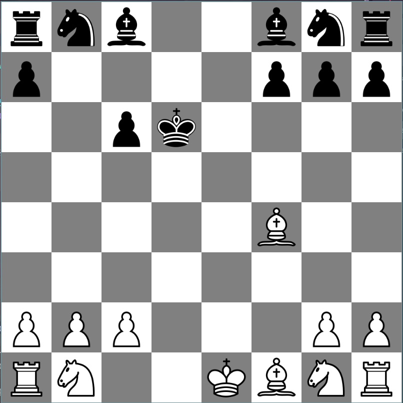

# Chess

A professional two-player chess game written in C using SDL3.

## Features
- Classic chess gameplay for two players
- Graphical interface powered by SDL3
- Custom piece sprites
- Smooth input handling
- Modular code structure

## Installation
1. Ensure you have SDL3 and a C compiler (e.g., GCC) installed.
2. Clone this repository:
   ```bash
   git clone http://github.com/dayaj1222/chess
   cd chess
   ```
3. Build the project:
   ```bash
   make
   ```

## Usage
Run the game executable:
```bash
./chess
```

## Screenshots
<!-- Add screenshots here -->



## License
MIT License. See [LICENSE](LICENSE) for details.

## Credits
- Developed by Daya Joshi
- SDL3 library
- Custom chess piece sprites
